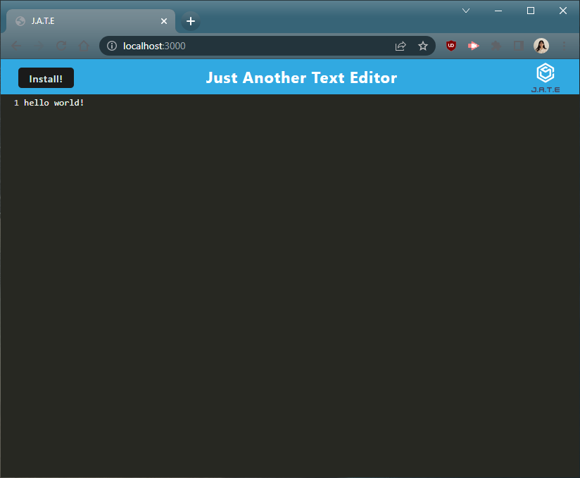

# Text Editor Starter Code
A crazy cool text editor you can use in any ole web browser!

## Description
Who needs Notepad or a Sticky Note app when you can use this text editor that opens in the web browser of your choice! 

As this is a Progressive Web App (PWA), after installing this, you don't even need to be online to use it. 

## Table of Contents

- [Installation](#installation)
- [Tech Used](#tech-used)
- [Preview](#preview)
- [Licensing](#licensing)
- [Contact Info](#contact-info)

## Installation
You can go to the PWA at the deployed link, or if you want a local copy of the repo, first clone the repo. To install, type `npm i` in the terminal's command line. 

To run the app, type `npm start` in the terminal. 

## Tech Used
* [Node.js](https://nodejs.org/en/)
* [Express.js](https://expressjs.com/)
* [WebPack](https://webpack.js.org/)
* [Workbox](https://developer.chrome.com/docs/workbox/)
* IndexedDB
* [Babel](https://babeljs.io/)
* [Heroku](https://www.heroku.com/)

## Preview

## Licensing
MIT License

## Contact Info
If you have any questions about the repo, contact Susan.